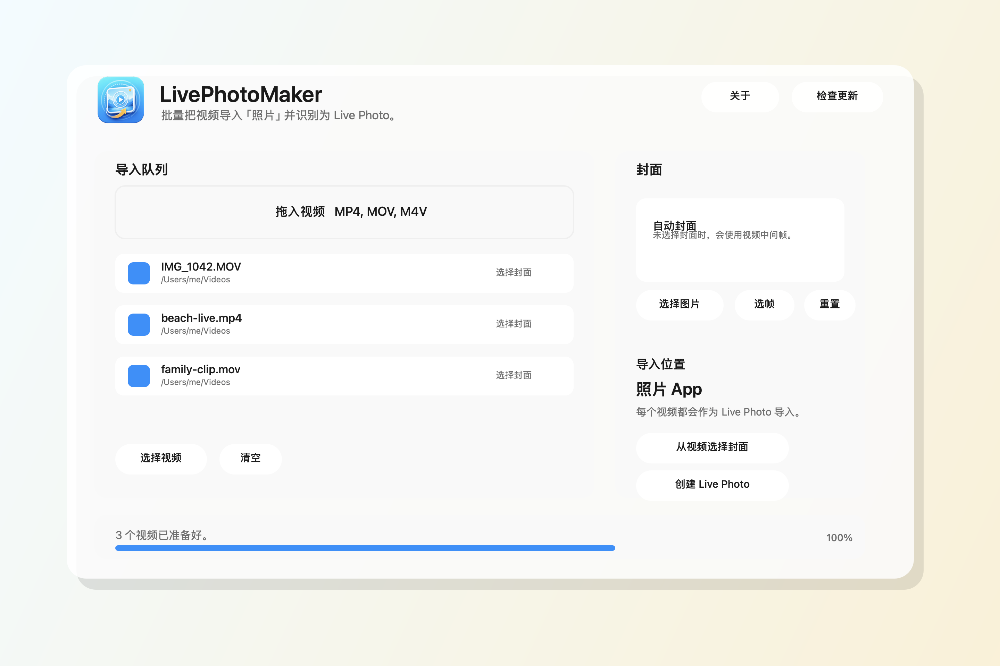

# LivePhotoMaker

LivePhotoMaker 是一个 macOS 小工具，可以把本地视频批量转换并导入到系统「照片」App，让 Photos 将其识别为 Live Photo。



## 功能

- 批量选择或拖拽导入本地视频文件
- 支持为每个视频单独选择 JPG、PNG、HEIC 等图片封面
- 支持从每个视频中选一帧作为独立封面
- 自动生成 Live Photo 所需的配对资源
- 写入 Apple Photos 识别需要的照片和 QuickTime 元数据
- 直接导入到 macOS「照片」App
- 关于本软件与检查更新
- 生成可拖拽安装的 DMG
- 支持隐藏命令行转换模式，便于调试

## 系统要求

- macOS 14 或更高版本
- Xcode 或 Command Line Tools
- 第一次导入时需要允许 App 访问「照片」图库

## 下载与安装

从 GitHub Release 下载 `LivePhotoMaker-版本号-macos.dmg`，打开后把 `LivePhotoMaker.app` 拖入 `Applications`。

如果提示“无法打开，因为 Apple 无法检查其是否包含恶意软件”，这是因为当前版本没有正式 Apple Developer ID 签名和 notarization。没有付费 Apple Developer Program 账号时，这是开源小工具比较常见的现实限制。

可选打开方式：

- 在 Finder 里右键 `LivePhotoMaker.app`，选择「打开」，再确认打开
- 或在终端执行：

```bash
xattr -dr com.apple.quarantine /Applications/LivePhotoMaker.app
```

## 使用方法

1. 打开 `LivePhotoMaker.app`
2. 将一个或多个视频拖入「导入队列」，或点击「选择视频」
3. 可选：在左侧选中某个视频后，点击「选择图片」为该视频设置封面
4. 可选：点击「选帧」或某个视频行右侧的小图片按钮，从对应视频里挑一帧作为该视频封面
5. 点击「创建 Live Photo」
6. 第一次使用时，macOS 会请求「照片」权限，请允许访问
7. 完成后打开「照片」App 查看导入结果

## 本地构建

在项目目录运行：

```bash
./build_app.sh
```

构建完成后会生成：

```text
.build/LivePhotoMaker.app
.build/dist/LivePhotoMaker.dmg
```

## 命令行转换

图形界面会自动导入 Photos。项目也保留了隐藏命令行入口，用于只生成 Live Photo 资源对：

```bash
.build/debug/LivePhotoMaker --convert /path/to/video.mp4 /path/to/output-folder
```

也可以传入自定义封面：

```bash
.build/debug/LivePhotoMaker --convert /path/to/video.mp4 /path/to/output-folder /path/to/cover.png
```

输出目录会得到一组同名的 `HEIC` 和 `MOV` 文件。

## GitHub Actions

仓库包含两个 workflow：

- `.github/workflows/build.yml`：push 到 `main` 或 PR 时构建，并上传 artifact
- `.github/workflows/release.yml`：推送 `v*` tag 时自动创建 GitHub Release 并上传 DMG

手动发版：

```bash
git tag v1.1.1
git push origin v1.1.1
```

## Live Photo 原理

Photos 识别 Live Photo 需要一张静态照片和一个配对视频。LivePhotoMaker 会：

- 从视频中提取中间帧，或使用用户选择的封面
- 自动抽帧写出时在支持的系统上匹配源视频动态范围，手动选帧会保存为更兼容的 SDR HEIC 以避免预览偏色
- 给 HEIC 写入 Apple Maker metadata 中的 asset identifier
- 在支持的系统上按 ISO HDR HEIC 写出，并请求生成/保留 gain map
- 将视频重新封装为 MOV
- 尽量保留源视频的容器 metadata 和音视频轨道 metadata
- 给 MOV 写入 `com.apple.quicktime.content.identifier`
- 添加 `com.apple.quicktime.still-image-time` metadata track
- 通过 Photos framework 用 `.photo` 和 `.pairedVideo` 资源类型导入

## 关于 HDR 与清晰度

视频轨道会尽量 passthrough 重新封装，避免重编码造成损失。封面最终会写为 HEIC；JPG、PNG、HEIC 等常见图片都可作为输入封面。自动抽帧和自定义封面写出时会在 macOS 支持时请求 HDR 解码、ISO HDR 编码和 gain map 生成；如果用户选择的 HEIC 封面本身带有 gain map，也会尽量保留。若 HDR 写出失败，会自动回退到普通 HEIC，避免因为单个封面或视频帧不兼容而转换失败。MOV 输出会尽量继承源视频的容器 metadata 和音视频轨道 metadata；为兼容更多 MOV 输入，会跳过 timecode、辅助图像等非音视频轨道，再写入 Live Photo 所需 metadata。因此它比 JPG 封面和只写基础 MOV metadata 更接近 iPhone 原生 Live Photo 的资源形态。

需要注意的是，gain map 是否实际写入取决于 macOS/ImageIO 版本、输入帧是否包含足够的 HDR 信息，以及系统编码器是否接受该输入。LivePhotoMaker 会走最高保真路径并保留可用信息，但仍不能保证完全复刻 iPhone 相机拍摄时的所有私有元数据。
